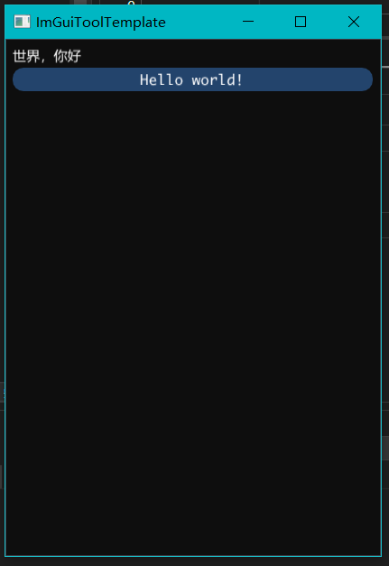

# ImGuiToolTemplate
 


UIMain.cpp

```c++
void UIMainWindowInit(char* title, int* width, int* height)
{
    ::strcpy_s(title, 256, __PROJECT_NAME);
    *width = 400;
    *height = 600;
}

void UIMainStyleInit()
{
    ImGui::StyleColorsDark();
    ImGuiStyle& style = ImGui::GetStyle();
    style.FrameRounding = 12;
}

void UIMainUpdate()
{
    ImGui::Text("世界，你好");
    if (ImGui::Button("Hello world!", {-1,0}))
    {

    }
}
```

